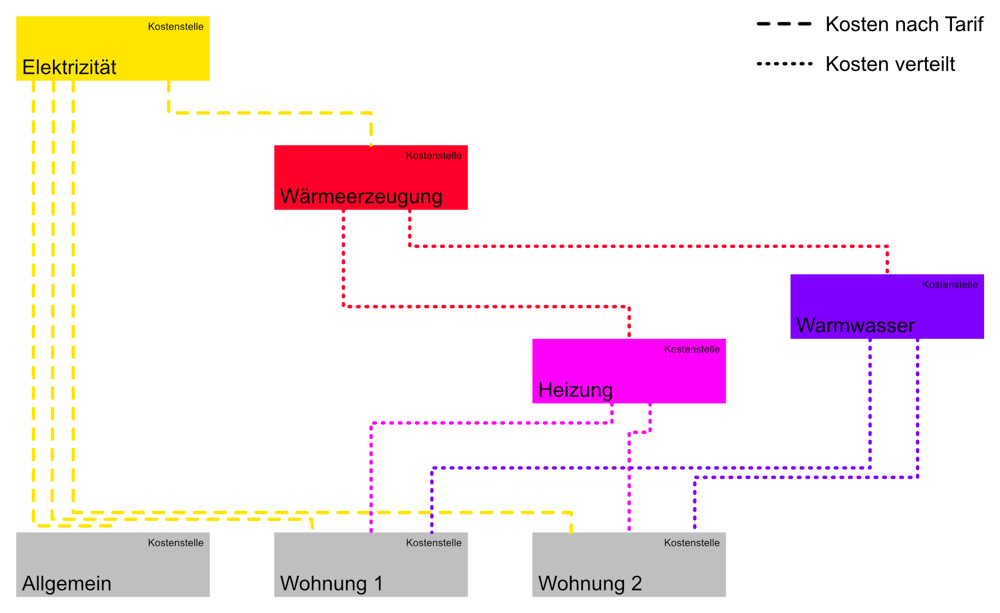

Wenn Sie Daten von Ihren Zählern erhalten, können Sie diese nutzen, um automatische Abrechnungen zu erstellen. Kosten können dabei entweder aufgeteilt (z.B. nach VHKA) oder nach Tarif pro Einheit festgelegt werden. Auch Mischformen sind möglich.

### Beispiel

Eine **Kostenstelle** kann:
* andere Kostenstellen versorgen (*Elektrizität*)
* von anderen Kostenstellen verbrauchen (*Allgemein*, *Wohung 1*, *Wohnung 2*)
* beides (*Wärmeerzeugung*, *Heizung*, *Warmwasser*)

Zur Verknüpfung zwischen Kostenstellen werden **Kostenverteiler** eingesetzt. Kostenverteiler können:
* Kosten aufgrund eines Tarifs zuteilen, welcher einer Zählereinheit zugeordnet ist (Kostenverteiler - Art: Einheitenbasiert).
Im obigen Beispiel: den verbauchenden Kostenstellen von *Elektrizität* wird ein fester Tarif pro kWh verrechnet.
* Kosten aufgrund des relativen Verbrauchs im Verhältnis zu anderen Zählereinheiten verteilen (Kostenverteiler Art: Verteilt).
Im obigen Beispiel: den verbrauchenden Kostenstellen von *Heizung* werden die Kosten im Verhältnis des gemessenen Verbrauchs verrechnet.
* Kosten aufgrund eines fest zugewiesenen Anteils verteilen (Kostenverteiler -  Art: Zugeteilt).
Im obigen Beispiel: den verbrauchenden Kostenstellen von *Wärmeerzeugung* werden die Kosten im festen Verhältnis 70% Heizung/30% Warmwasser verrechnet.

### Erfassen

Kostenstellenstrukturen können sehr komplex sein. Die Strukturen gehen häufig über eine einfache Vererbung hinaus, weshalb diese kaum grafisch dargstellt werden können. Deshalb kann es schwierig sein, den Überblick zu behalten. Erstellen oder bearbeiten Sie Kostenstellenstrukturen nur, wenn Sie deren Verhalten vollständig verstanden haben.


Erstellen Sie zuerst eine Liste mit benötigten Kostenstellen. Pro Objekt, das eine Abrechnung erhält (zum Beispiel eine Wohnung), benötigen Sie eine Kostenstelle. Desweiteren benötigen Sie eine Kostenstelle pro Kostenart, die Sie verteilen möchten. Sie können Kosten auch weitervererben, zum Beispiel den Stromverbrauch einer Wärmepumpe. Einige einfache Beispiele:
* Elektrizitätskosten: 
    * Kostenstelle "Elektrizität"
* Heizungs und Warmwasserkosten aus Fernwärme:
    *   Übergeordnete Kostenstelle "Wärmeerzeugung", auf welche Kostenpositionen gebucht werden können
    *   Untergeordnete Kostenstellen "Heizung" und "Warmwasser", welche die Kosten von "Wärmeerzeugung" aufteilen.
* TV-Gebühren
    *   Übergeordnete Kostenstelle "TV-Gebühren"

Ergänzen Sie dann auf dieser Liste, in welchem Verhältnis und mit welcher Zuteilungsart die Kostenverteilung geschehen soll, und welches die verbrauchende Kostenstelle ist. Die Liste aus unserem Beispiel könnte wie folgt aussehen:

| Kostenstelle   | Verhältnis | Art             | Berechnungsgrundlage                                                                     | Verbrauchende Kostenstelle |
|----------------|------------|-----------------|------------------------------------------------------------------------------------------|----------------------------|
| Elektrizität   | 1          | Einheitsbasiert | Wärmepumpe > Elektrizität > Energiebezug | Wärmeerzeugung             |
| "              | 1          | Einheitsbasiert | Allgemein > Elektrizität > Energiebezug  | Allgemein                  |
| "              | 1          | Einheitsbasiert | Wohnung 1 > Elektrizität > Energiebezug  | Wohnung 1                  |
| "              | 1          | Einheitsbasiert | Wohnung 2 > Elektrizität > Energiebezug  | Wohnung 2                  |
| Wärmeerzeugung | 1          | Zugeteilt       | 75 %                                                                                     | Heizung                    |
| "              | 1          | Zugeteilt       | 25 %                                                                                     | Warmwasser                 |
| Heizung        | 0.7        | Verteilt        | Wohnung 1 > Heizung > Energiebezug       | Wohnung 1                  |
| "              | 0.3        | Zugeteilt       | 35m2                                                                                     | "                          |
| "              | 0.7        | Verteilt        | Wohnung 2 > Heizung > Energiebezug       | Wohnung 2                  |
| "              | 0.3        | Zugeteilt       | 65m2                                                                                     | "                          |
| Warmwasser     | 0.7        | Verteilt        | Wohung 1 > Warmwasser > Wasserbezug      | Wohung 1                   |
| "              | 0.3        | Zugeteilt       | 35m2                                                                                     | "                          |
| "              | 0.7        | Verteilt        | Wohnung 2 > Warmwasser > Wasserbezug     | Wohung 2                   |
| "              | 0.3        | Zugeteilt       | 65m2                                                                                     | "                          |
| ~~Allgemein~~  |            |                 |                                                                                          | ~~keine~~                  |
| ~~Wohnung 1~~  |            |                 |                                                                                          | ~~keine~~                  |
| ~~Wohnung 2~~  |            |                 |                                                                                          | ~~keine~~                  |

Diese Struktur kann nun in Lexgate eingepflegt werden.

#### Kostenstellen
Kostenstellen können im Menüpunkt  einfach mit dem Inline-Formularerfasst werden. Kostenstellen haben nur zwei Parameter:
* : Ein beliebiger Name für eine Kostenstelle. Der Name sollte dem Projektumfang gerecht werden. In einem grösseren Projekt benötigen Sie unter Umständen genauere Bezeichnungen als in einem einfachen Mehrfamilienhaus. Achten Sie darauf, dass Sie die Kostenstelle anhand des Namens eindeutig identifizieren können.

*  (optional): Sie können eine Gruppe auswählen, die mit der Kostenstelle korrespondiert. Wenn Sie eine korrespondierende Gruppe auswählen, können Sie später die Funktion *Gruppenberechtigung setzen* verwenden, welche einem Vertragskontakt automatisch Zugriff auf die *Analsyse* der entsprechenden Gruppe gewährt. Dies macht also nur Sinn, wenn es sich um eine Kostenstelle handelt, welche eine Abrechung erhält.

#### Kostenverteiler
Als nächstes erfassen Sie die Kostenverteiler auf den dazugehörigen Kostenstellen. Benutzen Sie dazu Ihre Liste als Referenz. Klicken Sie auf den Namen der ersten Kostenstelle und wechseln Sie zum Tab . Benutzen Sie nun das Inline-Formular um einen Kostenverteiler hinzuzufügen.

* : Die Kostenstelle, an welche die Kosten überwälzt werden sollen.

*  Standart:  = 100%; Falls die Kosten von mehreren Parametern abhängig sind, können diese zur Berechnung mit einem Verhältnis belegt werden. Sind zum Beispiel 70% der Kosten vom gemessenen Verbrauch abhängig, setzen Sie hier  ein. Sie müssen dann einen weiteren Kostenverteiler mit  erstellen, welcher die restlichen 30% der Kosten verteilt, zum Beispiel wenn dies ein zugeteilter Wert aufgrund der Grundfläche ist.

* :
    * : Der Kostenanteil wird aufgrund eines statischen Werts berechnet. Geben Sie als  zum Beispiel   ein, wird zuerst eine Summe aller Werte mit dem gleichen  gebildet, und anschliessend der Kostenanteil, welcher der aktuelle Kostenverteiler ausmacht, auf die verbrauchende Kostenstelle gebucht.
    * : Der Kostenanteil wird aufgrund eines Zählerwerts berechnet. Unter  können Sie eine beliebige Zählereinheit auswählen. Bei der Berechnung wird die Differenz der Zählerstände zwischen Start- und Enddatum ermittelt. Diese Differenz im Verhältnis zur Summe aller anderen Zählerstände mit der selben Einheit ergibt den Kostenanteil, der auf die verbrauchende Kostenstelle gebucht wird.
    * : Die Kosten werden aufgrund des hinterlegten Tarifs berechnet. Als  können Sie den Tarif einer beliebigen Zählereinheit festlegen.

* : Falls nötig können Sie einen oder mehrere Ausgleichsfaktoren erfassen. Zur Eingabe gibt es eine einfache Syntax: Zwischen Faktor-Name und Faktor-Wert muss ein `:` eingefügt werden, und zwischen mehrerer Faktoren ein `;`. Wollen Sie also zum Beispiel zwei Faktoren erfassen, könnte die Eingabe so aussehen: `Erster Faktor: 0.75; Zweiter Faktor: 0.5`.