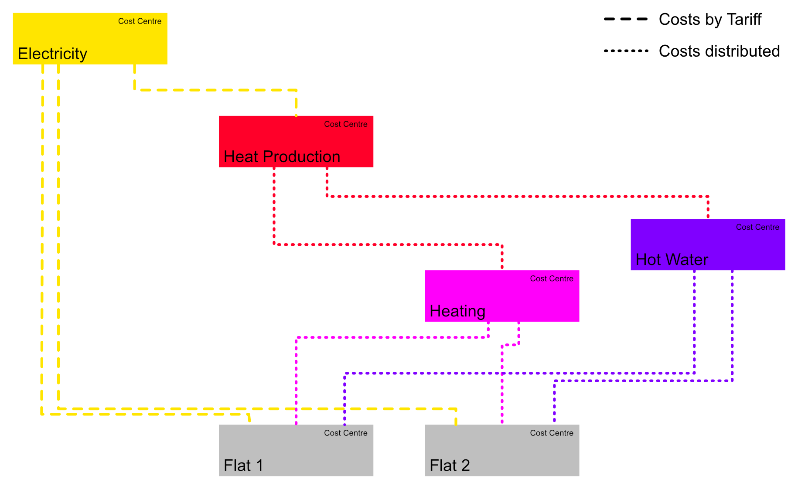

When you got data from your Meters, you can use this data to create automatic generated utility bills. Costs can be either distributed or a tariff per unit can be defined. It's also possible to mix both variants.

### Example

A **Cost Centre** can:
* provide to another Cost Centres (*Electricity*)
* consume from other Cost Centres (*Public*, *Flat 1*, *Flat 2*)¨
* both (*Heating System*, *Room Heating*, *Hot Water*)

To associate two Cost Cetnres we use **Cost Allocators*.
Cost Allocators can:
* Assign Costs based on a Tariff, which is assigned to a Meter Unit (Cost Allocator - Type: Unit based).
In this example: The consumers of *Electricity* get charged a defined Tariff per kWh.
* Distribute Costs based on the relative consumption in relation to other Meter Units (Cost Allocator - Type: Distributed). In this example: the consumers of *Room Heating* will be charged the costs of heating by their relative consumption in relation to the other Cost Allocators.
* Allocated Costs based on defined proportion (Cost Allocator - Type: Allocated)
In this example: the consumers of *Heating System* will be charged in fixed proportion of 75% Heating / 25% Hot Water.

### Creation

Cost Centre structures can be very complex. These structures often step out of a simple inheritance, and therefore and not suitable for graphic visualization. It can be hard to keep the overview. Create or change Cost Centre structures only, if you fully understand them.


Start by creating a list of the required Cost Centres. For each entity that receives an utility bill (for example a flat) you will need a Cost Centre. You will also need a Cost Centre for eachcost type you want to distribute. 

Add to this list the relation and the assotiation type for the consuming cost centres. The list from our example could look like this:

| Cost Centre    | Ratio | Type        | Calculation base                                                                          | Consumer       |
|----------------|-------|-------------|-------------------------------------------------------------------------------------------|----------------|
| Electricity    | 1     | Unit Based  | Heat Pump > Electricity > Energy Consumption | Heating System |
| "              | 1     | Unit Based  | Flat 1 > Electricity > Energy Consumption    | Flat 1         |
| "              | 1     | Unit Based  | Flat 2 > Electricity > Energy Consumption    | Flat 2         |
| Heating System | 1     | Allocated   | 75 %                                                                                      | Room Heating   |
| "              | 1     | Allocated   | 25 %                                                                                      | Hot Water      |
| Room Heating   | 0.7   | Distributed | Flat 1 > Heating > Energy Consumption        | Flat 1         |
| "              | 0.3   | Allocated   | 35m2                                                                                      | "              |
| "              | 0.7   | Distributed | Flat 2 > Heating > Energy Consumption        | Flat 2         |
| "              | 0.3   | Allocated   | 65m2                                                                                      | "              |
| Hot Water      | 0.7   | Distributed | Flat 1 > Hot Water > Water Consumption       | Flat 1         |
| "              | 0.3   | Allocated   | 35m2                                                                                      | "              |
| "              | 0.7   | Distributed | Flat 2 > Hot Water > Water Consumption       | Flat 2         |
| "              | 0.3   | Allocated   | 65m2                                                                                      | "              |
| ~~Flat 1~~     |       |             |                                                                                           | ~~none~~       |
| ~~Flat 2~~     |       |             |                                                                                           | ~~none~~       |

You can now create the structure like this.

#### Cost Centres
Cost Centres are created in  with the inline form. They have only two parameters:

* : Customizable name for the Cost Centre. The Name should match the size of the projects. For a bigger project you will need a more detailed name than for a simple Multi-family residential. Make sure the name is a unique identifier for the Cost Centre.

*  (optional): You can choose a group which is corresponding to the Cost Centre. If you select a group here, you can use the functionality *Set group authorization* in Contracts, which allows Contacts to access the Analysis for their Groups. So this property should only be set for Cost Centres which receive a bill.

#### Cost Allocators
Now, you can create the Cost Allocators. Use your list as reference. Click on the name of the First Cost Centre of your list and switch to tab . Use the inline form to add a new Cost Allocator:

* : The Cost Centre which will receive the costs.

* : Default  = 100%; If the costs are depending on multiple parameters, you can set a ratio for each parameter. Let's assume 70% of the costs are distributed from the measured consumption: set a Ratio of . Make sure to create a second Cost Allocator with , which distributed the remaining 30% of the costs.

* :
    * : The costs are calculated based on a predefined value. So, if you use a  of  , Lexgate sums up all values with the same , calculates the proportion of the current Cost Allocator, and allocates this propotion of costs to the consumer.
    * : The costs are calculated based on a measured value. You can choose any Meter Unit for the . For the calculation, the difference between start and end date is used. This difference in proportion to the sum of all other consumption with the same unit is the cost proportion distributed to the consumer.
    * : The costs are calculated based on the predifned Tariff per unit. For the  you can chose any Tariff of a Meter Unit.

* : If neccesary, it's possible to define multiple compensation factors. To fill the input you must use a simple syntax: Between name and value use `:`, and between multiple factors use `;`. If you want to insert to factors, you woul use: `First Factor: 0.75; Second Factor: 0.5`.